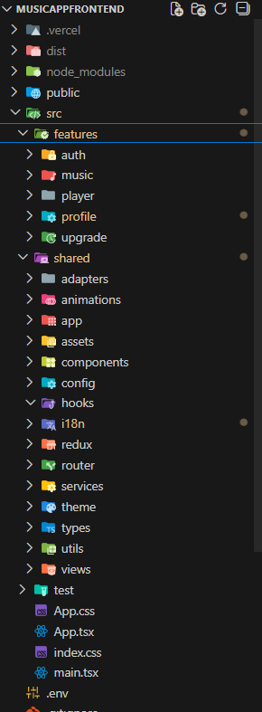

# 🎧 Music App — Frontend

A modern **Spotify-like music application frontend** built with React and TypeScript.  
The app focuses on **professional frontend architecture**, clean separation of concerns, and real-world features such as authentication, premium subscriptions, favorites, listening history, and integrations with external APIs.

This project was designed as a **portfolio-grade application**, prioritizing scalability, maintainability, and real production patterns. Developed over **~40 hours** of focused, tracked work, covering architecture, authentication, API integrations, payments, and deployment.

---

## 🚀 Live Demo

👉 [https://musicappbackend-ccph.onrender.com/](https://musicappbackend-ccph.onrender.com/)

---

## 🧠 Features

- 🔐 User authentication & protected routes
- 🎵 Music browsing (artists, tracks, playlists, genres)
- 🔍 Global search with autocomplete dropdown
- ❤️ Add/remove favorite tracks
- 🕒 Listening history per authenticated user
- 👤 User profile with:
  - Favorites
  - History
  - Theme switch
  - Language switch (i18n)
- 💳 Premium upgrade with Stripe Checkout
- 🏷️ Premium badge reflected in UI
- 🌍 Multi-language support
- 🎨 Dark / light theme support
- ⚡ Fully client-side cached data with React Query

---

## 🛠️ Tech Stack

| Category        | Tech |
|-----------------|------|
| Framework       | React 19 |
| Language        | TypeScript |
| Styling         | Tailwind CSS |
| State           | Redux Toolkit + Redux Persist |
| Data Fetching   | React Query (TanStack) |
| Routing         | React Router v7 |
| Animations      | Framer Motion |
| Forms           | React Hook Form |
| HTTP Client     | Axios |
| Internationalization | i18next |
| Tooling         | Vite |
| Testing         | Vitest, Testing Library |

---

## 🧩 Architecture & Folder Structure

The frontend follows a **feature-based architecture**, separating UI from business logic and external integrations.

  

Each feature is self-contained and includes:
- services (API calls)
- hooks (React Query)
- Redux slices (when needed)
- UI components
- view entry points

---

## 📌 Implementation Highlights

- **Clean separation of concerns**
  - UI components are stateless
  - Business logic lives in hooks and services
- **Protected routes** using a dedicated `ProtectedRoute`
- **Hybrid architecture**
  - Backend manages user state
  - Spotify API provides music data
- **Stripe integration**
  - Secure checkout
  - Premium state handled via backend webhook
- **Scalable search**
  - Debounced input
  - Cached results
  - Autocomplete UX
- **Optimized data flow**
  - React Query handles caching, refetching, and loading states

---

## 📦 Libraries & Integrations

### Core Dependencies

| Library | Purpose |
|------|--------|
| react | UI framework |
| react-router-dom | Client-side routing |
| @tanstack/react-query | Server state & caching |
| @reduxjs/toolkit | Global state management |
| redux-persist | State persistence |
| axios | HTTP requests |
| tailwindcss | Styling |
| framer-motion | Animations |
| react-hook-form | Forms |
| i18next / react-i18next | Internationalization |

### Dev & Tooling

| Tool | Purpose |
|----|--------|
| Vite | Development & build |
| TypeScript | Static typing |
| ESLint | Code quality |
| Vitest | Testing |
| Testing Library | UI testing |

---

## 🧪 Dev Experience & Best Practices

- Strict TypeScript configuration
- Feature-driven folder structure
- Reusable and testable hooks
- Predictable state management
- Clean routing and navigation
- Scalable styling with Tailwind
- Production-like patterns (auth, payments, protected views)
  
### ⏲️ Time Tracking

- Total tracked development time: **39h 57m**
- Sessions logged individually across architecture, frontend, backend, and integrations

---

## 📬 Contact

**Facundo Robert**  
Frontend / Full Stack Developer  

- 💼 LinkedIn: [Facundo Robert](https://www.linkedin.com/in/robertfacundodev/) 
- 💻 Portfolio: [My Portfolio](https://facundorobert.vercel.app/)   
- 📧 Email: robertf.coder@gmail.com 

---

⭐ If you like this project or found it useful, feel free to star the repo!
